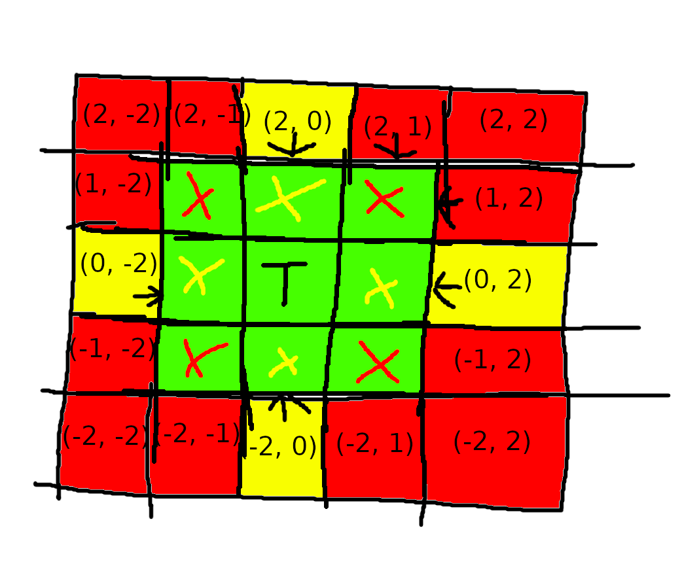

# Day 9
The image I used to help me visualize the moves the tail has to make.

- `T` - The position of the tail/knot
- `green fields` - Where the previous knot can be without the tail needing to move
- `yellow fields` - If the previous knot moves onto them the tail needs to only move up/down/left/right
-  `red fields` - If the previous knot moves here the tail needs to move diagonally
-  `(x, y)` - Coordinate of the field relative to the tail `(0, 0)`
- `X` - Shows where the tail would need to move when the previous knot moves to the matching color position

The corners also need to be handled when dealing with multiple tails since a tail can move diagonally.
